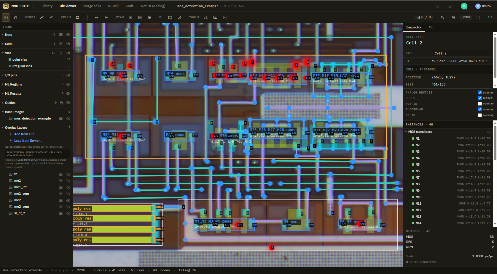
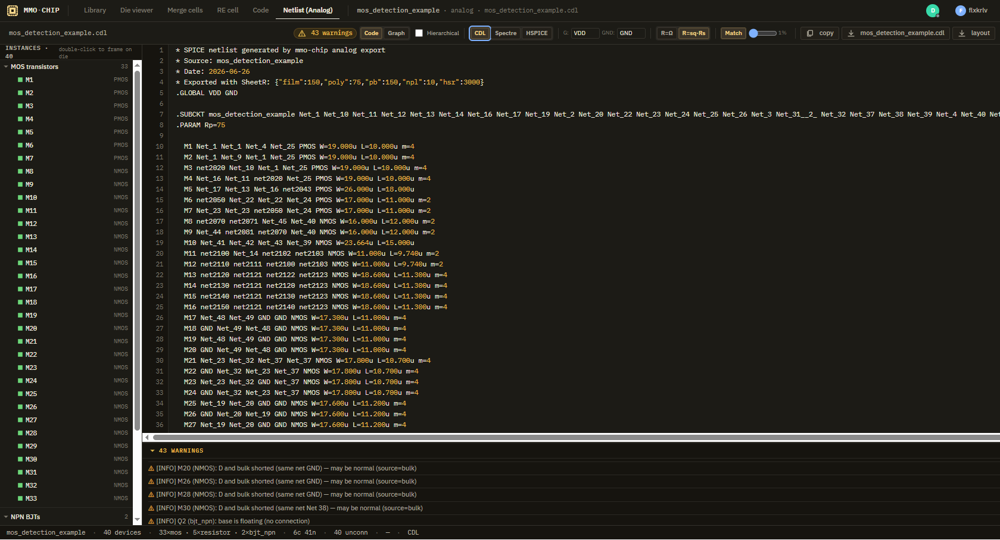
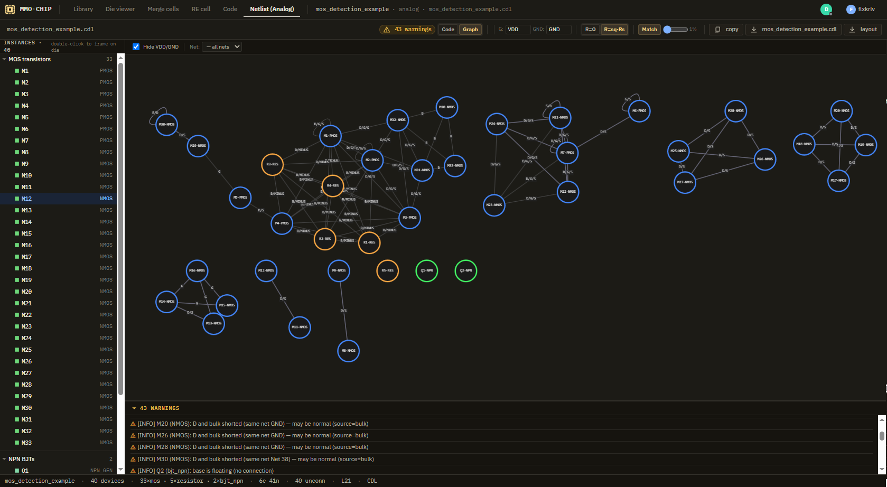

# mmo-chip — analog-re-wip

**Форк [mmo-chip](https://github.com/giulioz/mmo-chip) для реверс-инжиниринга аналоговых и mixed-signal ИС.**  
Исходный проект ориентирован на цифровые CMOS Gate Array / Standard Cell чипы и извлекает логические вентили и Verilog-нетлист.  
Этот форк расширяет его до **BJT, BiCMOS, резисторов, конденсаторов, диодов** — всей аналоговой периферии, которая не укладывается в модель стандартных ячеек.

## Благодарности (ENG)
Many thanks to the developers of the original [mmo-chip](https://github.com/giulioz/mmo-chip).  
Clean architecture, thoughtful modularity, and clear interfaces between the frontend, backend, and shared types are an excellent base for custom extensions, for example, for RE analog blocks and chips.

Оригинальный CMOS-маршрут (стандартные ячейки, логика, Verilog) **не тронут** — аналоговая экстракция работает как надстройка. Мы старались не сломать цифровой маршрут, но это нуждается в проврерке - у нас нет опыта в цифровой логике и примеров снимков таких кристалов. 

```
┌─────────────────────────────────────────┐
│                mmo-chip                  │
├────────────────┬────────────────────────┤
│  CMOS Logic    │  Analog Extraction      │
│  (оригинал)    │  (наша ветка)           │
├────────────────┼────────────────────────┤
│ extractCell()  │ extractMarkedDevices()  │
│ gates.ts       │ simpleAnalog.ts         │
│ logic.ts       │ dieWideAnalog.ts        │
│ verilog.ts     │ spice.ts                │
├────────────────┼────────────────────────┤
│ Standard cells │ NPN, LPNP, MOS, R, C, D │
│ Gate-level     │ Transistor-level        │
│ Verilog        │ SPICE/CDL/Spectre       │
└────────────────┴────────────────────────┘
```


*Die viewer с обнаруженными аналоговыми приборами: цветные bbox с подписями, терминальные метки (G, S/D, B, C, E), параметры (W/L, AE, Ω)*

---

## Поддерживаемые устройства

| Устройство | Детекция | Параметры |
|---|---|---|
| **NMOS / PMOS** (3-/4-терминальные) | **Well-based**: nwell→PMOS, pwell→NMOS. Без маркеров — автоматически по пересечению diffusion + polysilicon. **Все MOS** (включая single-finger) используют **Clipper2** для разрезания diffusion между затворами. N gate fingers → N+1 сегментов → N отдельных MOS | W, L, fingers, multiplier. Bulk: контакт на nwell/pwell вне diffusion/poly → positive netId. Если нет → sentinel -2 → VDD/GND (настраиваемые имена) |
| **NPN** | Маркер `npn_id` с collector + base + emitter | AE (overlap base∩emitter), multiplier M |
| **PNP / LPnp** (латеральный PNP) | Маркер `pnp_id` | AE, PE (периметр эмиттера), multiplier M |
| **Диод** | Маркер `diode_id` **или** NPN/PNP без коллектора — base=анод(+), emitter=катод(-). Терминалы: PLUS через `["base","bulk"]`, MINUS через `["emitter"]` с приоритетами (emitter 0 > base 1) | Площадь (AE из base-emitter overlap) |
| **Резистор** | **Геометрическая детекция** (res_id не требуется): тело резистора (poly/base/emitter/hsr/film) → ME1, пересекающий тело → контакты на ME1 → группы контактов = PLUS/MINUS. Рисуется polyline-инструментом (`L`) с ортогональным snap. Ширина в µm (слайдер 0–200µm). При клике — выделяется вся цепочка сегментов | Ω или squares×Rₛ. Поддерживаются body-слои: poly-R, p-base (pb), n+ (npl), HSR (high-sheet), thin film. Множественные резисторы в одной ячейке |
| **Конденсатор** | Маркер `cap_id` — ёмкость из overlap-области | fF = площадь × плотность (1 fF/µm² по умолчанию) - проверить |

---

## Как рисовать устройства

### MOS-транзистор (well-based, маркеры не нужны)

MOS детектируется **автоматически** по пересечению слоёв — отдельно рисовать маркеры не требуется.

| Слой | Назначение |
|---|---|
| `nwell` | PMOS-транзисторы ищутся внутри nwell |
| `pwell` | NMOS-транзисторы ищутся внутри pwell |
| `diffusion` | Тело транзистора (исток + сток) |
| `polysilicon` | Затворы, пересекающие diffusion |

1. Нарисуйте `nwell` (для PMOS) или `pwell` (для NMOS) на Cell RE.
2. Внутри well нарисуйте `diffusion` — это область истока и стока.
3. Нарисуйте `polysilicon` поперёк diffusion — это затвор(ы).
4. **Bulk:** нарисуйте `cont` (contact) на nwell/pwell **вне** diffusion и polysilicon. Если контакт попадает и на diffusion — он считается S/D, не bulk. Если bulk-контакта нет — sentinel -2 → VDD (PMOS) / GND (NMOS). Имена VDD/GND настраиваются в Analog Netlist → SubBar.
5. **Металлизация:** соедините diffusion-области через контакты и metal1 с остальной схемой.
6. **Multi-finger (несколько затворов на одной diffusion):** Clipper2 (`polygonDifference()`) разрезает diffusion между затворами. Каждый gate finger → отдельный MOS. Shared сегмент между затворами — D для левого и S для правого (одинаковый netId при wire matching).

7. **Metal-connected D/S:** Если drain/source двух разных транзисторов соединены ME1 (или ME2 через via1) внутри ячейки — они получают один cell-level netId. Union-Find по metal1+metal2+via1+contact.

W/L, fingers, сегменты вычисляются автоматически.


.png)
*Cell RE: 3 PMOS в одной ячейке (multi-finger и single-finger). Clipper2 разрезает diffusion, poly gate net grouping объединяет затворы.*

> Подробное описание MOS detection pipeline — [`docs/mos_detection.md`](docs/mos_detection.md).

### BJT (NPN / PNP)

| Слой | Назначение |
|---|---|
| `npn_id` | Bounding box NPN |
| `pnp_id` | Bounding box PNP |
| `collector` | Область коллектора |
| `base` | Область базы |
| `emitter` | Область эмиттера |

1. **Выберите bounding box:** нарисуйте `npn_id` (NPN) или `pnp_id` (PNP / LPnp) — прямоугольник, охватывающий весь прибор.
2. **Нарисуйте слои:** collector, base, emitter — в виде rect или polygon внутри bbox.
3. **Контакты:** поставьте `cont` (contact) на каждый слой. Инструмент сам сопоставит контакты с выводами.
4. **Для PNP / LPnp** PE (perimeter) = периметр эмиттера — используется как основной параметр.
5. **Multi-emitter:** нарисуйте несколько эмиттеров внутри одного bbox — инструмент сложит их площади и выставит multiplier M.

> **Важно:** emitter должен лежать **внутри** base (или пересекаться с ней). Это layout-ориентированный физический подход, понятный для топологов

### Диод

**Способ 1 — маркер `diode_id`:**  
Нарисуйте `diode_id` — прямоугольник вокруг области диода. Не тестировался

**Способ 2 — из BJT без коллектора (рекомендуемый):**  
Нарисуйте `npn_id` (или `pnp_id`) с `base` + `emitter`, но **без** `collector`.  
Инструмент автоматически распознает прибор как диод:
- Base = анод (PLUS)
- Emitter = катод (MINUS)
- AE (overlap base ∩ emitter) = площадь диода

### Резистор

| Слой | Назначение |
|---|---|
| `res_id` | Bounding box резистора | --< LEGACY! БОЛЬШЕ НЕ ИСПОЛЬЗУЕТСЯ, заменен геометрической детекцией 
| `poly` / `polysilicon` | Тело (poly-резистор) |
| `base` | Тело (p-base diffusion) |
| `emitter` | Тело (n+ diffusion) |
| `hsr` | Тело (High Sheet Resistance — ионная имплантация) |
| `film` | Тело (тонкоплёночный) |
| `contact` | Контакты (минимум 2) |

1. **res_id** больше не требуется — детекция чисто геометрическая: тело → ME1 → контакты → группы = PLUS/MINUS.
2. Выберите **body-слой**: poly, base, emitter, hsr, film. Рисуйте тело ТОЛЬКО polyline-инструментом (`L`), даже для прямых резисторов.
3. Нарисуйте ME1, **перекрывающийся с телом резистора**. Поставьте минимум 2 контакта (`contact`) — они станут PLUS и MINUS.
4. **Polyline-режим:**
   - `L` — активировать инструмент
   - Ширина в µm (слайдер 0–200µm, шаг 1) задаётся ДО рисования в тулбаре
   - Ортогональный snap (90°) в реальном времени
   - Каждый сегмент суммируется в общую длину
   - Opacity слайдер в тулбаре — наложение полупрозрачного слоя на изображение для проверки совпадения ширины
5. Ширину нарисованного резистора можно поменять: кликните на любом сегменте → выделится вся цепочка → в правой панели (внизу) поле Width в µm. Drag-move для line shapes отключён (не ломать геометрию).

> **Sheet R₀:** настраивается в GUI (по умолчанию: poly=25 Ω/□, hsr=1500 Ω/□, pb=200 Ω/□, npl=5 Ω/□, film=500 Ω/□). Это базовые ориентировные значения, которые могут меняться в широких пределах
> Сопротивление = squares × sheetR₀. Можно переключать отображение между Ω и sq·Rs.

### Конденсатор (не тестировался)

1. Нарисуйте `cap_id` — bounding box (overlap-область = ёмкость).
2. PLUS и MINUS — оба на `contact` слое.

---

## Управление (горячие клавиши)

### Die Viewer — инструменты

| Клавиша | Инструмент |
|---|---|
| `S` | Select (выделение) |
| `W` | Wire (трасса) — первое нажатие M1, повторное переключает M1↔M2 |
| `E` | Via up — ставит via в позиции курсора и переключает слой на следующий (M1→M2) |
| `Q` | Via down — ставит via и переключает слой на предыдущий (M2→M1) |
| `B` | Multi-wire / Bus |
| `O` | Via (контактное окно) |
| `K` | Ruler / Measurement (линейка) |
| `R` | Add Cell (добавить ячейку) |
| `P` | I/O Point (вход/выход) |
| `F` | Fit to Screen / Pan |
| `+` / `=` | Zoom in |
| `-` | Zoom out |

### Die Viewer — навигация по вкладкам

| Клавиша | Вкладка |
|---|---|
| `1` | Die viewer |
| `2` | Merge cells |
| `3` | RE cell |
| `4` | Code |
| `5` | Analog Netlist |

### Cell RE — инструменты

| Клавиша | Инструмент |
|---|---|
| `R` | Rect (прямоугольник) |
| `P` | Polygon (многоугольник) |
| `O` | Point / via (точка / контакт) |
| `L` | Polyline (меандр-резистор, ортогональный snap) |

### Undo / Redo

| Клавиши | Действие |
|---|---|
| `Ctrl+Z` / `⌘Z` | Undo |
| `Ctrl+Shift+Z` / `⌘⇧Z` | Redo |

### Overlay-изображения (общие)

| Клавиши | Действие |
|---|---|
| `Ctrl+Shift+B` | Показать / скрыть базовое изображение (фото кристалла) |
| `]` | Показать **только** следующий overlay-слой (N+1), остальные скрыть |
| `[` | Показать **только** предыдущий overlay-слой (N-1), остальные скрыть |
| `Ctrl+Shift+1..8` | Показать **только** overlay-слой №1..8, остальные скрыть |

Работают на всех трёх вкладках: Die Viewer, Merge Cells, RE Cell. (надо проверять)

### Merge Cells — режимы просмотра

| Клавиша | Режим |
|---|---|
| `Alt+1` | Overlay (наложение) |
| `Alt+2` | Side-by-side (рядом) |
| `Alt+3` | Difference (разница) |
| `Alt+4` | Specimen only (только образец) |
| `Alt+5` | Candidate only (только кандидат) |

### Analog Netlist — горячие клавиши

| Клавиша | Действие |
|---|---|
| `G` | Переключить Code / Graph вид |
| `H` | Hierarchical on/off |
| `R` | Формат резистора (Ω / sq·Rs) |
| `M` | Device matching on/off |

### Cell RE — прочее

| Клавиши | Действие |
|---|---|
| `Ctrl+C` / `⌘C` | Копировать выделенные фигуры |
| `Ctrl+V` / `⌘V` | Вставить |
| Пробел (hold) | Временный Pan (в любом инструменте) |

---

## Экспорт / Импорт проекта

Проект можно выгрузить с сервера и импортировать на другой инстанс.

- **`POST /api/dies/:dieId/export-project`** — экспорт в JSON (light: только аннотации / full: + изображения)
- **`POST /api/dies/import-project`** — импорт с обработкой конфликтов (перезапись / пропуск)
- **`POST /api/dies/:dieId/rename`** — переименование кристалла
- Экспорт preferences из localStorage

Full-экспорт сохраняет оригинальное изображение + overlay-изображения, так что сторонние проекты восстанавливаются полностью (с изображениями).

---

## Floorplan регионы (v0.2)

Инструмент для выделения аналоговых блоков на топологии кристалла. Прямоугольные и полигональные регионы.

### Возможности
- **Рисование:** rect (drag-based) или polygon (вершины по клику, двойной клик / Enter завершает)
- **Popover:** редактирование имени, цвета, алиасов портов, резервация
- **Резервация:** опционально — показать, кто работает над блоком (для мультиплеера)
- **Port aliases:** назначение человекочитаемых имён для граничных портов блока
- **Global rename:** алиасы переименовывают нет на die (через `PUT /api/dies/:dieId/nets/:uuid`)
  При снятии алиаса — исходное имя восстанавливается
  При коллизии (одинаковый алиас у двух разных netId) — авто-суффикс `_1`, `_2`
- **Port dots:** цветные кружки с именами портов на die-вьювере
  При выделении блока — на его портах; галочка "FP IO" — на всех блоках сразу
- **Layer:** дисплей поверх всего, обводка без заливки, клик проходится насквозь до канваса

### Горячие клавиши

| Клавиша | Действие |
|---|---|
| `H` | Активировать инструмент "Floorplan" |
| `Ctrl+Shift+H` | Показать/скрыть overlay регионов |

---

## Schematic Viewer (netlist2svg)

Транзистор-уровневые схемы и функциональные блок-диаграммы, генерируемые из SPICE-нетлиста.

### Возможности

- **Analog mode:** полноценная transistor-level схема с NMOS/PMOS/NPN/PNP, резисторами, конденсаторами, диодами, источниками — все найденные на die устройства
- **Functional mode:** блок-диаграмма, где каждый floorplan-регион отображается как прямоугольник с I/O портами. Кросс-регионные соединения — провода между блоками. Устройства вне регионов рисуются аналоговыми символами рядом с блоками
- **Пан/зум** через `@panzoom/panzoom` (drag для панорамирования, колесо для зума, кнопки +/−/⊖)
- **Device tooltips** (React overlay): при наведении на устройство — имя, тип, параметры (W/L для MOS, AE/M для BJT, Ω/sq/тип для резисторов)
- **Power net coloring:** VDD — красный, GND — синий (на схеме + connected wires)
- **ELK layout:** настраиваемая стратегия (Brandes-Koepf / Interactive / Simple), направление (DOWN/RIGHT/UP/LEFT), степень сжатия (0–4)
- **Экспорт:** SVG (тёмная/светлая тема), PNG (2×), Yosys JSON
- **Per-region просмотр:** кнопки регионов в Analog mode для изолированного просмотра каждого floorplan-блока

### Движок

Используется [netlist2svg](https://github.com/ajsb85/netlist2svg) (ELK.js для layout) с кастомным SVG-скином, который заменяет стандартные netlistsvg-символы на реалистичные 4-терминальные MOS (D/G/S/B), BJT, резисторы, диоды.

Ранее экспериментировали с `@spice-ts/ui` в качестве альтернативного рендерера, но он был заменён из-за низкого качества отрисовки и отсутствия кастомизации.

---

## Иерархический SPICE-нетлист

При создании floorplan регионов появляется возможность генерировать **иерархический** (а не плоский) нетлист.

- **Плоский (flat):** все устройства и соединения на одном уровне — поведение по умолчанию
- **Иерархический:** каждое устройство попадает в .SUBCKT своего региона (по центру). 
  Порт региона = net, который соединяет устройства внутри и снаружи (boundary net).
  Порты автоматически детектятся по соединениям устройств.

### Переключатель "Hierarchical"
На вкладке Analog Netlist (таб `5`) — чекбокс в панели экспорта. 
По умолчанию Off (сохраняется старый плоский нетлист).

### Формат

```spice
// Spectre hierarchical netlist
// Source: lmv341

subckt fp1 (fp2in1 VDD GND)
  M1 (net2030 fp2in1 net2032 net2033) PMOS W=28.655u L=7.905u
ends fp1

subckt lmv341 (Net_20 fp2in1 fp3in1 fp3in2 fp3out1 VDD GND)
  X1 (fp2in1 VDD GND) fp1
  X2 (fp2in1 fp3out1 VDD GND) fp2
  M1 (Net_20 fp3in2 fp3in1 Net_20) PMOS W=54.674u L=4.611u
ends lmv341
```

---

## Комментарии на топологии

Аннотации в виде кликабельных иконок на die-вьювере. Позволяют оставлять заметки на физической топологии.

- **Добавление:** инструмент "Comment" (пин) в тулбаре — клик в нужной точке
- **Popover:** текст, автор, дата, список ответов
- **WS:** новые комментарии приходят всем, кто открыл die, в реальном времени
- **Данные:** хранятся как опциональное поле `comments[]` в DieAnnotations — обратно совместимо

---

## Net ID overlay

Отображает человекочитаемые имена нетов на die viewer — те же имена, что в SPICE-нетлисте.

- Переключается галочкой в боковой панели
- Имена вычисляются из `netNameMap` (коллектор die-широких устройств)
- VDD/GND/VSS/0 не подписываются (избыточно)

---

## Предупреждения нетлиста

Подробная документация всех предупреждений при генерации SPICE/CDL — [`docs/netlist_warnings.md`](docs/netlist_warnings.md).

| Префикс | Значение |
|---|---|
| `[WARN]` | Вероятная ошибка (D=S short, emitter на VDD и т.д.) |
| `[INFO]` | Подозрительно, но может быть нормально (floating gate, dummy resistor) |

Предупреждения отображаются в Collapsible-панели внизу вкладки Analog Netlist и в начале сгенерированного файла как комментарии.

---

## Управление слоями (Cell RE)

В Cell RE доступны слои для рисования аналоговых устройств:

| Слой | Группа |
|---|---|
| `diffusion` / `polysilicon` / `nwell` / `pwell` | MOS |
| `collector` / `base` / `emitter` | BJT |
| `hsr` / `film` | Резисторы (high-sheet / thin film) |
| `npn_id` / `pnp_id` / `res_id` / `cap_id` | Маркеры |
| `metal1` / `contact` | Металлизация |

---

## Ключевые изменения относительно оригинального mmo-chip (main)

- **Well-based MOS** — единственный путь для MOS. **Все MOS** (single-finger + multi-finger) используют Clipper2 (`polygonDifference()`) для разрезания diffusion между затворами. Каждый gate finger → отдельный MOS. Shared сегменты между gate (D gate[i] = S gate[i+1]) получают одинаковый netId.
- **Poly gate grouping (polyGateNetMap)** — физически соединённые poly shapes (через Clipper2 overlap) получают один gate netId. Shared poly bus подсвечивается в overlay.
- **Gate тёрминал включает все poly shapes** из polyGateNetMap-компоненты (не только режущие diffusion), поэтому shared poly bus корректно подсвечивается в overlay.
- **Metal-connected D/S merging** — drain/source, соединённые ME1/ME2+via1 внутри ячейки, получают общий cell-level netId. Union-Find идентичный cell.ts Step 2.
- **Diode из BJT** — рисование NPN/PNP без коллектора автоматически даёт диод. PLUS через слои `["base","bulk"]`, MINUS через `["emitter"]`. Приоритет: emitter(0) > base(1) для разрешения коллизий.
- **BJT с multiple emitter** — AE суммируется, multiplier M = количество эмиттеров (надо проверять)
- **Polyline Tool** — рисование резисторов-меандров с 90° ортогональным snap (включая превью), редактируемой шириной в µm (слайдер 0–200µm, шаг 1). Opacity слайдер для наложения на изображение. Клик выделяет всю цепочку сегментов. Drag-move отключён. Геометрическая детекция: тело → ME1 → контакты → PLUS/MINUS группы.
- **Ruler Tool** (клавиша `K`) — измерение расстояний на кристалле. Режимы: free, horizontal, vertical, orthogonal, diagonal (45°). Double-click → ввод размера в µm → umPerPx сохраняется.
- **Wire: слой трассы (ME1/ME2) и via-переходы** — при рисовании трассы (W) выбирается слой металла (m1/m2).
  **Контакт устройства всегда подключается только к ME1** — ME2+ требует via-перехода.
  **Горячие клавиши mid-draft:**
  - `E` — ставит `point_via` в позиции курсора и переключает на следующий слой (ME1→ME2)
  - `Q` — ставит via и переключает на предыдущий слой (ME2→ME1)
  Via создаётся как `HumanAnnotation` и участвует в snap-to-via.
- **Overlay-изображения** — мультислойные SEM / doping / металл-изображения, загружаемые с сервера или из файла, с горячими клавишами управления.
- **Analog overlay на die viewer** — каждый обнаруженный прибор: цветной прямоугольник с подписью (`M1 pmos`, `Q3 npn`, `R5 poly res`...) и параметрами. Терминальные метки (G, S/D, C, B, E) при зуме >0.7×, параметры >0.5×.
- **SPICE/CDL/Spectre экспорт** — корректный Spectre-формат. MOS: w/l/m без AS/AD/PS/PD. BJT: AE, PE, M. Резисторы: r=Ω. Диоды: are a=AREA. Три диалекта.

  
  *Пример сгенерированного SPICE-нетлиста с обнаруженными приборами и предупреждениями*

- **BJT normalisation** — поиск минимального AE (NPN) / PE (PNP) → это m=1, остальные масштабируются.
- **VDD/GND config persistence** — имена supply net-ов настраиваются в SubBar, сохраняются на backend с debounced auto-save.
- **Cell RE device review** — force override W/L, AE, R, fingers через GUI. (надо проверять)
- **Layout CSV + SKILL шаблон** для импорта в Cadence.
- **Net Graph** (Cytoscape.js) — force-directed граф соединений приборов. Режимы: пока только D2D (device-to-device)

  
  *Net Graph: граф соединений приборов*

- **Per-net color override** — цвета выводов сохраняются в preferences.
- **uuid polyfill** — `crypto.randomUUID()` не работает через Network IP; заменён на `uuid()` с fallback Math.random() для v4.
- **Overlay-изображения на Merge Canvas + RE Cell Canvas** — с clipping по cell area и глобальными hotkeys.
- **Floorplan regions** — rect/polygon регионы с цветом, именем, резервацией, алиасами портов
- **Hierarchical SPICE netlist** — генерация .SUBCKT на каждый регион с автодетекцией boundary nets
- **Schematic viewer (netlist2svg)** — transistor-level схемы и функциональные блок-диаграммы с ELK layout, пан/зумом, тултипами, раскраской питания, экспортом SVG/PNG
- **Global port rename** — алиасы портов переименовывают annotation net на die через API
- **Port dots overlay** — визуализация граничных портов на die viewer (выделенный блок / все блоки)
- **Comment annotations** — кликабельные иконки с текстом, автором, ответами на die viewer
- **Net ID overlay** — человекочитаемые имена нетов на die viewer
- **Project export/import** — light/full экспорт + импорт с обработкой конфликтов

---

## Что ещё не сделано (нужно и приоритетно)

- **DMOS** (LDMOS / VDMOS) — нет ни детекции, ни маркеров
- **Диод Шоттки** — отдельный маркер / детекция
- **VPNP** (вертикальный PNP) — слой `vpnp` добавлен в типы, но не детектится
- **JFET** — маркеры и geometry params в зачаточном состоянии
- **Wire matching на die-wide уровне** — допуск привязан к размеру контакта (`contactTolerance()`: tol = size×0.5, без запаса). На плотных разводках возможны ложные срабатывания — тестировать
- **Редактирование polyline после размещения** — stretch/reshape сегментов (только перерисовать заново)
- **Сериализация overlay-изображений** в JSON аннотаций (пока статика)
- **Hierarchical netlist + floorplan:** базовый функционал готов, но требуется тестирование на реальных кейсах
  - Alias collision: проверить при чистом старте (нет старых алиасов с неправильными netId)
  - Global rename: проверка revert при снятии алиаса
  - Скорость rename: множественные `PUT /api/dies/:dieId/nets/:uuid` при большом количестве алиасов

---

## ⚠️ Предупреждение

**Всё ещё альфа / WIP.** Код покрыт только unit-тестами extraction pipeline (29/30 pass; 1 pre-existing resistor R= fail).  
Нет сквозных (e2e) тестов, нет тестов на overlay, wire matching, SPICE-экспорт, cross-tab навигацию.
Не было тестирования пользователями.

**Возможны:**
- Критические ошибки и потеря данных
- Некорректные нетлисты (особенно на сложной разводке)
- Ложные срабатывания / пропуски при детекции на плотных аналоговых блоках

Проверяйте результаты визуально и перекрёстно с оригиналом (даташит / layout / SEM).  
Пишите баг-репорты и тестовые кейсы.

---

## Структура репозитория

```
frontend/     Vite + React + TypeScript — die viewer, cell RE, analog netlist, overlay
backend/      Node + TypeScript API — import, tiling, JSON persistence, WebSocket
shared/       Shared TypeScript types (annotation schema + analog device types)
ml/           Python U-Net (опционально, для assisted annotation)
docs/
  analog-devices.md              ← актуальное описание детекции аналоговых приборов
  mos_detection.md               ← MOS detection pipeline (Clipper2, polyGateNetMap, metal merge)
  netlist_warnings.md            ← все предупреждения при генерации SPICE/CDL
  lvs_rules_examples/            ← примеры LVS-правил для аналоговых слоёв
  reference/
    analogDevices.ts             ← legacy auto-detection (reference), см. docs/reference/README.md
```

Ключевые файлы аналоговой экстракции:

```
frontend/src/
  api/
    dieWideAnalog.ts              ← DEVICE_TERMINAL_DEFS / DIODE_DEFS, resolveDeviceContacts, collectDieWideAnalogDevices
    analogNetlist.ts              ← loadSpiceConfig / saveSpiceConfigToBackend, SPICE netlist generation
  lib/extraction/
    simpleAnalog.ts               ← extractMarkedDevices, detectMOSFromLayers, splitDiffusionAtGates (Clipper2)
    clipper.ts                    ← Clipper2 WASM wrapper (polygonDifference, polygonIntersection)
    common.ts                     ← shapeToPolygon, polygonBounds, SpatialIndex
  lib/export/hierarchical.ts      ← floorplan geometry, port detection, alias collision resolver
  lib/export/spice.ts             ← netlist generation (CDL/Spectre/HSPICE + hierarchical)
  components/dieViewer/
    AnalogDeviceHighlights.tsx    ← canvas overlay
    FloorplanOverlay.tsx          ← floorplan region rendering + port dots
    FloorplanRegionPopover.tsx    ← popover for region edit + port aliases
  components/cellRE/
    CellREToolbar.tsx             ← инструменты Cell RE
    useLayerPolylineTool.ts       ← polyline (резистор-меандр)
  state/cellRE.ts                 ← TOOL_LAYERS, ReToolKind, polyline state
  lib/hotkeys.ts                  ← центральный registry горячих клавиш (все страницы)
  lib/useOverlayHotkeys.ts        ← overlay-хоткеи
  routes/
    AnalogNetlistPage.tsx         ← Analog Netlist вкладка
    RECellPage.tsx                ← RE Cell страница

docs/
  analog-devices.md               ← полное описание детекции и API (актуально)
  mos_detection.md                ← MOS detection pipeline
  reference/
    analogDevices.ts              ← legacy Phase 1 auto-detection (reference only)
```

---

## Запуск

```sh
# Node ≥ 20
npm install

# Запуск всего (бэкенд + фронтенд + ML sidecar):
npm run dev

# По отдельности:
npm run dev -w backend    # http://localhost:3001
npm run dev -w frontend   # http://localhost:5173
```

Тесты:

```sh
npm test                                             # все тесты
node --import tsx --test backend/src/analog-extraction.test.ts  # только extraction
```

---

